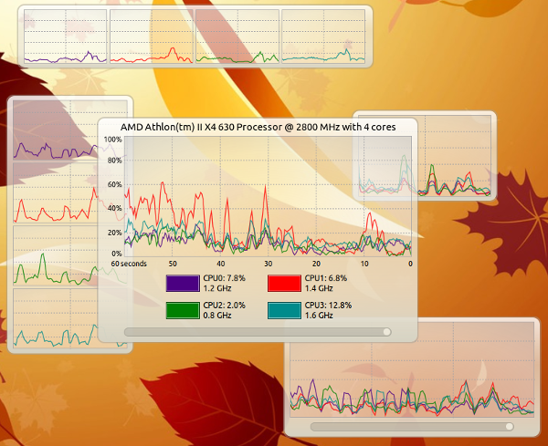

# CPU Graph

A desktop widget which graphs CPU usage. It sits quietly in the background
monitoring every core of your processor. Press a hotkey to review the recent
activity of your CPU, and press it again to hide the graph.

  

CPU Graph can be adjusted to a variety of layouts

Version 1.1.0, written by Anthony Walter using Free Pascal, Lazarus, and the
Codebot Pascal Library.

## Features

* Smooth curved lines for every core, drawn in twelve distinct colors
* A time slider to look back through up to one hour of history
* A borderless widget you can drag anywhere and resize from any corner
* A layout which adapts to the size of the window
* Live usage and clock speed for each core
* A tray icon with a menu to show or hide the graph and to quit

## Using CPU Graph

Press **Ctrl + Alt + U** to show or hide the graph. The tray icon menu does
the same thing.

Drag the widget to move it. Move the mouse near a corner to reveal a resize
grip, then drag the grip to resize the widget.

Click the colored box beside a core in the stats area to hide or show that
core in the graph.

Drag the slider below the graph to look back in time. Move it all the way to
the right to return to the live view.

### Layouts

The widget picks a layout based on its size:

* **Large:** one graph showing every core, with a caption, scales, a
  timeline, and stats for each core underneath
* **Short or narrow:** a grid of small graphs, one for each core, so many
  cores fit on screen without a huge window
* **Width:** narrow graphs show the last 20 or 30 seconds, while wider graphs
  show the last 60 seconds

### Smoothing

Samples are averaged into one second buckets fixed to the clock, then joined
with curves. A curve never changes shape once it is drawn. To make this
possible the graph runs about two and a half seconds behind real time.

## Building

CPU Graph builds with Lazarus using the GTK3 widgetset. It needs these
packages from the Codebot Pascal Library:

* codebot
* codebot_controls

Open `src/cpugraph.lpi` in Lazarus, choose the **Release** build mode, and build.
The Release mode is optimized with no debug information and stripped symbols.

The project includes a Debian package description in `src/cpugraph.mkdeb` for use
with the MakeDeb packaging tool.
